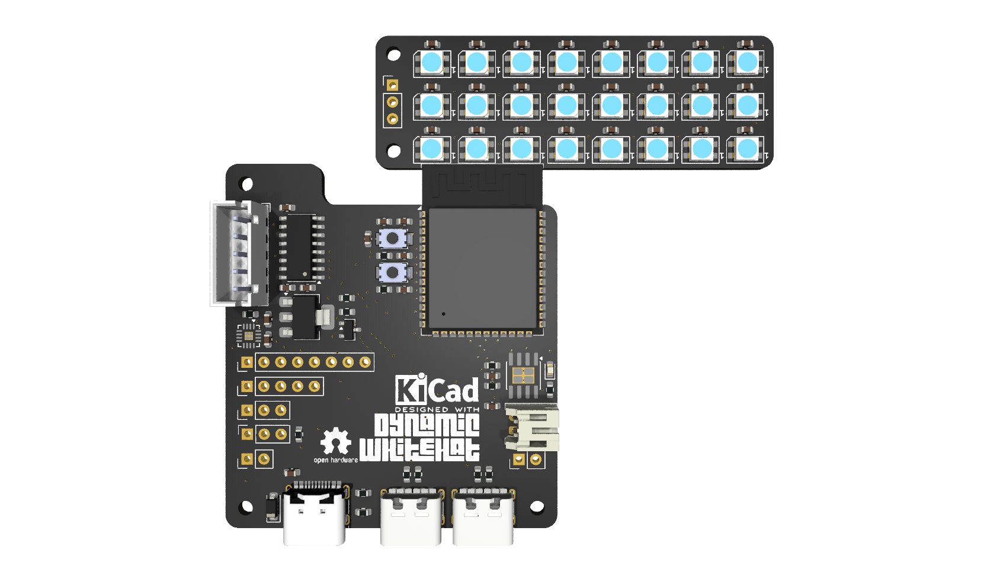
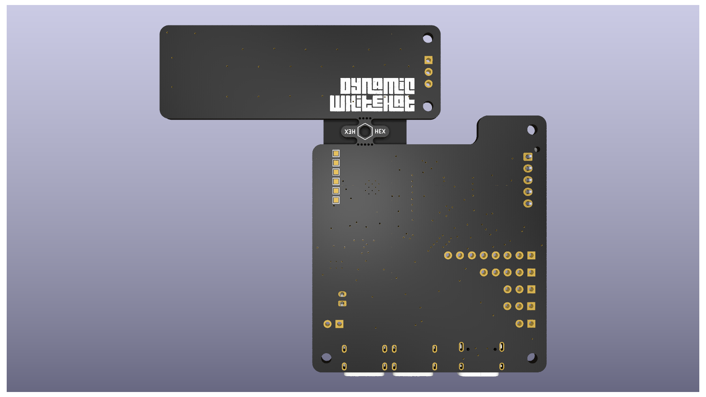

# Reverb
A custom record player. Place a disk and have it play. Original idea by AKZ Dev on YouTube.

## Features:
- ESP32 S3 Wroom 1 SoM
- 8Ω 10W Speaker
- Disks correspond to songs through an RFID reader
- Gesture sensor for touch-free volume control
- Working stylus that can start and stop music
- 3x8 audio visualizer array
- 2x USB out: 3.0 A at 5V

## Why I designed this project

I saw [this](https://www.youtube.com/watch?v=fBjv4E7mpA4) video on YouTube one day, and I wanted to make my own version. He used an RPi Zero with other modules. I decided that I wanted to improve on this design by making a custom ESP32-based PCB, a built in speaker, and other small features. I also found another video about an ESP32 speaker with an audio visualizer, so I decided to add that through a 3x8 neopixel array. I have gotten better at routing PCBs as a result of this project, and I have also gained a sense of how to make good-looking PCB layouts.

## Image gallery:
<table align="center">
  <tr>
    <td align="center">
      
    </td>
    <td align="center">
      
    </td>
  </tr>
  <tr>
    <td align="center" colspan="2">
      
    </td>
  </tr>
</table>

## Schematic, PCB, And Layout
<table align="center">
  <tr>
    <td align="center" colspan="2">
      
    </td>
  </tr>
  <tr>
    <td align="center">
      
    </td>
    <td align="center">
      
    </td>
  </tr>
  <tr>
    <td align="center" colspan="2">
      
    </td>
  </tr>
</table>

## How It Works
The main control board is based on an ESP32-S3 Wroom 1, which is Wifi and Bluetooth enabled. This allows me to connect the SoM to my phone or other device running Spotify. Using the web API, I can control music that plays from my device. Reverb also uses a MAX98357A I2S amplifier that is wired to an 8Ω 10W speaker, allowing audio playback from the music player instead of the device. Additionally, a 3x8 SK6812 Mini NeoPixel array is mounted on the front of the case with a thin wall, allowing audio playback to be visualized. The PAJ7620U2 gesture sensor, located under the REVERB logo on the case, can detect gestures to increase or decrease volume, skip tracks, and perform other tasks. Finally, the main component in the whole design is the RC522 RFID sensor, which picks up data from the RFID stickers located within the 3D printed disks. This allows each disk to be mapped to a song, allowing playback that feels real.

## Bill Of Materials
| Item                      | Quantity     | Link                                                                                   | Price  | Comment                                            |
|---------------------------|--------------|----------------------------------------------------------------------------------------|--------|----------------------------------------------------|
| JLCPCB Order              | 1            | Quote                                                                                  | $17.20 | PCB+Stencil                                        |
| LCSC Order                | 1            | See LCSC BOM                                                                           | $27.68 | PCB Parts                                          |
| Stepper Motor             | 1            | https://www.aliexpress.us/item/2251832816516054.html                                   | $2.73  |                                                    |
| RC522 RFID Reader         | 1            | https://www.aliexpress.us/item/3256805262944828.html                                   | $2.47  |                                                    |
| RFID Tag                  | 1 Pack of 30 | https://www.aliexpress.us/item/3256807346917359.html                                   | $3.08  |                                                    |
| PAJ7620U2 Gesture Sensor  | 1            | https://www.aliexpress.us/item/3256803918726745.html                                   | $5.09  |                                                    |
| Speaker                   | 1            | https://www.aliexpress.us/item/3256806860528919.html                                   | $8.12  |                                                    |
| Power Switch              | 1 Pack of 5  | https://www.aliexpress.us/item/3256803938436290.html                                   | $2.12  |                                                    |
| SD Card Reader            | 1            | https://www.aliexpress.us/item/3256805115720436.html                                   | $0.83  |                                                    |
| US5881 Hall Effect Sensor | 1 Pack of 10 | https://www.aliexpress.us/item/3256806135616417.html                                   | $1.81  |                                                    |
| M2-M5 Screw Set           | 1            | https://www.amazon.com/mxuteuk-Assortment-Machine-Washers-Printing/dp/B0FM3G5K6H/?th=1 | $7.99  | From Amazon as AliExpress doesn't sell assortments |
|                           |              |                                                                                        | $79.12 |                                                    |

### LCSC Bill Of Materials
| LCSC                                                                                                    |                 |                       |                    |                 |                |          |                                                   |
|---------------------------------------------------------------------------------------------------------|-----------------|-----------------------|--------------------|-----------------|----------------|----------|---------------------------------------------------|
| Description                                                                                             | Quantity Needed | Mrf#                  | Minimum Order Qty. | Unit Price(USD) | Ext.Price(USD) | LCSC#    | Product Link                                      |
| 100nF ±10% 50V Ceramic Capacitor X7R 0603                                                               |              28 | CC0603KRX7R9BB104     |                100 |          0.0021 |           0.21 | C14663   | https://www.lcsc.com/product-detail/C14663.html   |
| 10kΩ ±1% 100mW 0603 Thick Film Resistor                                                                 |               3 | 0603WAF1002T5E        |                100 |          0.0011 |           0.11 | C25804   | https://www.lcsc.com/product-detail/C25804.html   |
| 10uF ±10% 10V Ceramic Capacitor X5R 0603                                                                |               5 | CL10A106KP8NNNC       |                 50 |          0.0065 |           0.33 | C19702   | https://www.lcsc.com/product-detail/C19702.html   |
| 1MΩ ±1% 100mW 0603 Thick Film Resistor                                                                  |               2 | 0603WAF1004T5E        |                100 |          0.0011 |           0.11 | C22935   | https://www.lcsc.com/product-detail/C22935.html   |
| Diode Independent 40V 1A Surface Mount SOD-123                                                          |               1 | K1N5819HW-7-F         |                 50 |          0.0133 |           0.67 | C2891704 | https://www.lcsc.com/product-detail/C2891704.html |
| 1kΩ ±1% 100mW 0603 Thick Film Resistor                                                                  |               1 | 0603WAF1001T5E        |                100 |          0.0012 |           0.12 | C21190   | https://www.lcsc.com/product-detail/C21190.html   |
| 1uF ±10% 50V Ceramic Capacitor X5R 0603                                                                 |               1 | CL10A105KB8NNNC       |                 50 |          0.0056 |           0.28 | C15849   | https://www.lcsc.com/product-detail/C15849.html   |
| 22uF ±20% 6.3V Ceramic Capacitor X5R 0603                                                               |               1 | CL10A226MQ8NRNC       |                 20 |          0.0094 |           0.19 | C59461   | https://www.lcsc.com/product-detail/C59461.html   |
| 4.7kΩ ±1% 100mW 0603 Thick Film Resistor                                                                |               4 | 0603WAF4701T5E        |                100 |          0.0011 |           0.11 | C23162   | https://www.lcsc.com/product-detail/C23162.html   |
| 4.7uF ±10% 16V Ceramic Capacitor X5R 0603                                                               |               2 | CL10A475KO8NNNC       |                 10 |          0.0102 |           0.10 | C19666   | https://www.lcsc.com/product-detail/C19666.html   |
| 5.1kΩ ±1% 100mW 0603 Thick Film Resistor                                                                |               2 | 0603WAF5101T5E        |                100 |          0.0011 |           0.11 | C23186   | https://www.lcsc.com/product-detail/C23186.html   |
| 634kΩ ±1% 100mW 0603 Thick Film Resistor                                                                |               1 | 0603WAF6343T5E        |                100 |          0.0007 |           0.07 | C65831   | https://www.lcsc.com/product-detail/C65831.html   |
| 6V Positive Fixed 3.3V SOT-223 Voltage Regulators - Linear, Low Drop Out (LDO) Regulators RoHS          |               1 | AP7361C-33E-13        |                  5 |          0.2779 |           1.39 | C500795  | https://www.lcsc.com/product-detail/C500795.html  |
| Diode Array 1 Pair Common Cathode 30V 200mA Surface Mount SOT-23                                        |               1 | BAT54C                |                 50 |          0.0095 |           0.48 | C727125  | https://www.lcsc.com/product-detail/C727125.html  |
| Connector Header 2 position 2mm Pitch 2A Right Angle -25℃~+85℃                                          |               1 | S2B-PH-K-S(LF)(SN)    |                 20 |          0.0355 |           0.71 | C173752  | https://www.lcsc.com/product-detail/C173752.html  |
| Connector Header 5 position 2.5mm Pitch 3A Through Hole -25℃~+85℃                                       |               1 | B5B-XH-A(LF)(SN)      |                  5 |          0.0826 |           0.41 | C157991  | https://www.lcsc.com/product-detail/C157991.html  |
| 2.4GHz ESP32-S3 Chip On-board PCB Antenna -98.2dBm SMD,25.5x18mm RF Transceiver Modules and Modems RoHS |               1 | ESP32-S3-WROOM-1-N8R8 |                  1 |          4.9347 |           4.93 | C2913201 | https://www.lcsc.com/product-detail/C2913201.html |
| Class D TQFN-16-EP(3x3) Audio Amplifiers RoHS                                                           |               1 | MAX98357AETE+T        |                  1 |          1.3216 |           1.32 | C910544  | https://www.lcsc.com/product-detail/C910544.html  |
| SMD-4P,3.7x3.5mm LED Addressable, Specialty RoHS                                                        |              24 | SK6812SMINI           |                 30 |          0.0617 |           1.85 | C7423118 | https://www.lcsc.com/product-detail/C7423118.html |
| Tactile Switch SPST 160gf 2mm SMD (SMT) Tab 4mm x 3mm Surface Mount                                     |               2 | TS-1088-AR02016       |                 10 |          0.0426 |           0.43 | C720477  | https://www.lcsc.com/product-detail/C720477.html  |
| Lithium-ion/Polymer ESOP-8                                                                              |               1 | TP4056                |                  5 |           0.091 |           0.46 | C382139  | https://www.lcsc.com/product-detail/C382139.html  |
| 50V 500mA SOIC-16 Bipolar Transistor Arrays RoHS                                                        |               1 | ULN2003ADR            |                  5 |          0.1121 |           0.56 | C7512    | https://www.lcsc.com/product-detail/C7512.html    |
| USB-C (USB TYPE-C) Receptacle Connector 6 Position Surface Mount                                        |               2 | TYPE-C-31-M-17        |                  5 |          0.1789 |           0.89 | C283540  | https://www.lcsc.com/product-detail/C283540.html  |
| USB-C (USB TYPE-C) Receptacle Connector 16 Position Surface Mount                                       |               1 | TYPE-C-31-M-12        |                  5 |          0.1908 |           0.95 | C165948  | https://www.lcsc.com/product-detail/C165948.html  |
| 5kΩ Thin Film Resistor ±25ppm/℃ ±0.1% 0603 Chip Resistor - Surface Mount RoHS                           |               1 | TR0603B5K00P0525Z     |                 20 |           0.028 |           0.56 | C3202451 | https://www.lcsc.com/product-detail/C3202451.html |
| 400mΩ ±1% 100mW 0603 Thick Film Resistor                                                                |               1 | FRL0603FR400TS        |                100 |          0.0035 |           0.35 | C5126047 | https://www.lcsc.com/product-detail/C5126047.html |
|                                                                                                         |                 |                       |                    | Combined Price  |         $17.69 |          |                                                   |
|                                                                                                         |                 |                       |                    | Shipping        |          $9.99 |          |                                                   |
|                                                                                                         |                 |                       |                    | Total Price     |         $27.68 |          |                                                   |
